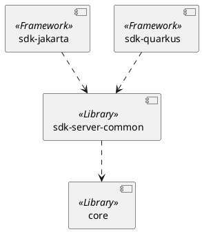

## A2A Java SDK 아키텍처

### **2. 모듈별 상세 설명**

#### **`core`**

* **역할**: 프로토콜의 핵심 데이터 구조 및 계약(Contracts) 정의
* **상세 내용**:
    * 모든 모듈에서 공통으로 참조하는 SDK의 가장 기본이 되는 모듈
    * 에이전트 간 통신에 사용되는 핵심 데이터 객체(DTO) 포함
        * **주요 모델**: `Task`, `Message`, `Artifact`, `AgentCard` 등
    * 통신 과정에서 발생할 수 있는 공통 예외(Exception)와 상태(Enum)를 정의

#### **`sdk-server-common`**

* **역할**: 서버 구현을 위한 프레임워크 독립적인 공통 로직 제공
* **상세 내용**:
    * Jakarta, Quarkus 등 특정 기술 프레임워크에 종속되지 않는 서버의 핵심 비즈니스 로직을 포함
    * 들어온 요청을 처리하고, 작업을 관리하며, 응답을 생성하는 공통의 흐름을 추상화하여 제공
    * 이를 통해 각 서버 구현체에서의 코드 중복을 최소화하고 일관성을 유지

#### **`sdk-jakarta`**

* **역할**: Jakarta REST(JAX-RS) 기반의 서버 구현체
* **상세 내용**:
    * `sdk-server-common`의 공통 로직을 Jakarta RESTful Web Services 표준에 맞게 연결하는 어댑터(Adapter) 역할 수행
    * HTTP 요청의 라우팅, 데이터 바인딩 등 Jakarta EE 환경에 특화된 웹 레이어 처리를 담당
    * 기존 엔터프라이즈 Java 환경 또는 Spring Boot와의 높은 호환성을 제공

#### **`sdk-quarkus`**

* **역할**: Quarkus Reactive Routes 기반의 서버 구현체
* **상세 내용**:
    * `sdk-server-common`의 공통 로직을 Quarkus 프레임워크에 통합하는 구현 레이어
    * 논블로킹(Non-Blocking) I/O 모델을 활용하여 높은 동시성과 처리량을 목표로 하는 리액티브(Reactive) 방식으로 서버를 구현
    * 클라우드 네이티브 및 마이크로서비스 아키텍처에 최적화된 성능(빠른 부팅, 낮은 메모리 사용량)을 제공
