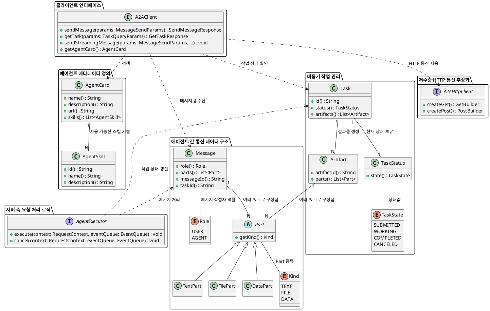

# CORE 모듈 분석

## Class Diagram


## A2A Java SDK 핵심 클래스 설명

### 1. 에이전트 메타데이터 정의: `AgentCard`, `AgentSkill`

* **`AgentCard`**:
    * **역할**: 특정 A2A 에이전트의 고유 식별자, 설명, 네트워크 접근 주소(URL), 그리고 핵심 기능(capabilities) 및 제공 서비스(skills)를 포함하는 메타데이터 명세
    * **기능**:
        * 에이전트의 식별(`name`, `description`, `url`, `version`)
        * 전반적인 처리 능력(`AgentCapabilities`): 스트리밍, 푸시 알림, 이력 관리 지원 여부 등
        * 인증 및 보안 요구사항(`securitySchemes`) 명시
    * **코드 스니펫**:
      ```java
      import io.a2a.spec.AgentCard;
      import io.a2a.spec.AgentCapabilities;
      import io.a2a.spec.AgentSkill;

      // 간단한 AgentCard 생성 예시
      AgentCard myAgentCard = new AgentCard.Builder()
              .name("Weather Agent")
              .description("Helps with weather information")
              .url("http://localhost:10001")
              .version("1.0.0")
              .capabilities(new AgentCapabilities.Builder().streaming(true).build())
              .skills(List.of(new AgentSkill.Builder().id("weather_search").name("Search weather").build()))
              .build();
      ```
* **`AgentSkill`**:
    * **역할**: `AgentCard` 내에서 에이전트가 수행할 수 있는 개별적인 서비스 또는 기능을 상세하게 정의
    * **기능**:
        * 스킬의 고유 식별자(`id`), 이름(`name`), 상세 설명(`description`)
        * 관련 태그(`tags`) 및 사용 예시(`examples`) 제공
    * **코드 스니펫**:
      ```java
      import io.a2a.spec.AgentSkill;
      import java.util.List;

      // AgentSkill 생성 예시
      AgentSkill weatherSearchSkill = new AgentSkill.Builder()
              .id("weather_search")
              .name("Search weather")
              .description("Helps with weather in a specified city or state.")
              .tags(List.of("weather", "information"))
              .examples(List.of("weather in Seoul", "current temperature in New York"))
              .build();
      ```

### 2. 에이전트 간 통신 데이터 구조: `Message`, `Part`

* **목적**: A2A 프로토콜에서 에이전트 간에 교환되는 정보의 기본 단위를 정의
* **`Message`**:
    * **역할**: 에이전트 간의 대화 및 정보 교환을 위한 핵심 데이터 객체
    * **기능**:
        * 메시지 발신자 역할(`role`): `USER` 또는 `AGENT`
        * 메시지 고유 식별자(`messageId`)
        * 메시지 내용물(`parts`): 다양한 형식의 데이터를 포함할 수 있는 `Part` 객체 리스트
        * 관련 작업(`taskId`) 및 대화 맥락(`contextId`) 연결
    * **코드 스니펫**:
      ```java
      import io.a2a.spec.Message;
      import io.a2a.spec.TextPart;
      import java.util.List;

      // 사용자 메시지 생성 예시
      Message userMessage = new Message.Builder()
              .role(Message.Role.USER)
              .parts(List.of(new TextPart("Tell me a joke.")))
              .build(); // messageId는 자동으로 생성됨

      // 에이전트 응답 메시지 생성 예시
      Message agentResponse = new Message.Builder()
              .role(Message.Role.AGENT)
              .parts(List.of(new TextPart("Why don't scientists trust atoms? Because they make up everything!")))
              .taskId("task-123") // 특정 작업에 연결
              .build();
      ```
* **`Part`**:
    * **역할**: `Message` 또는 `Artifact`의 실제 내용물을 구성하는 추상 데이터 단위
    * **하위 구현**:
        * `TextPart`: 일반 텍스트 데이터 표현
        * `FilePart`: 파일 데이터 표현 (바이트 배열 또는 URI 형태)
        * `DataPart`: 임의의 구조화된 데이터(JSON 오브젝트) 표현
    * **코드 스니펫**:
      ```java
      import io.a2a.spec.TextPart;
      import io.a2a.spec.FilePart;
      import io.a2a.spec.DataPart;
      import io.a2a.spec.FileWithBytes;
      import java.util.Map;
      import java.util.Base64;

      // TextPart
      TextPart text = new TextPart("Hello A2A!");

      // FilePart (바이트 배열)
      byte[] imageBytes = Base64.getDecoder().decode("BASE64_ENCODED_IMAGE_DATA");
      FilePart imageFile = new FilePart(new FileWithBytes("image/png", "sample.png", Base64.getEncoder().encodeToString(imageBytes)));

      // DataPart (JSON 데이터)
      Map<String, Object> dataMap = Map.of("city", "Seoul", "temperature", 25);
      DataPart jsonData = new DataPart(dataMap);
      ```

### 3. 비동기 작업 관리: `Task`, `TaskStatus`, `Artifact`

* **목적**: 단일 메시지 교환을 넘어선, 수명 주기를 가지는 복잡하고 비동기적인 작업의 정의 및 관리를 지원
* **`Task`**:
    * **역할**: 에이전트 간에 수행되는 연속적이거나 장기 실행되는 작업의 중심 단위
    * **기능**:
        * 작업 고유 식별자(`id`)
        * 현재 작업 상태(`status`) 포함
        * 작업 결과로 생성된 출력물(`artifacts`) 리스트
    * **코드 스니펫**:
      ```java
      import io.a2a.spec.Task;
      import io.a2a.spec.TaskStatus;
      import io.a2a.spec.TaskState;
      import java.util.Collections;

      // 새로운 Task 생성 예시
      Task newTask = new Task.Builder()
              .id("report-gen-123")
              .contextId("session-abc")
              .status(new TaskStatus(TaskState.SUBMITTED))
              .artifacts(Collections.emptyList()) // 초기에는 아티팩트 없음
              .build();
      ```
* **`TaskStatus`**:
    * **역할**: `Task` 객체에 포함되어, 작업의 현재 진행 상태(`state`)를 명시합니다.
    * **상태**: `SUBMITTED`, `WORKING`, `COMPLETED`, `CANCELED` 등 다양한 단계가 정의됩니다.
    * **코드 스니펫**:
      ```java
      import io.a2a.spec.TaskStatus;
      import io.a2a.spec.TaskState;

      // 작업 상태를 'WORKING'으로 업데이트
      TaskStatus workingStatus = new TaskStatus(TaskState.WORKING);

      // 작업 상태를 'COMPLETED'로 업데이트 (선택적으로 메시지 포함)
      TaskStatus completedStatus = new TaskStatus(TaskState.COMPLETED, new Message.Builder().role(Message.Role.AGENT).parts(List.of(new TextPart("Report generated successfully."))).build(), null);
      ```
* **`Artifact`**:
    * **역할**: `Task`의 실행 결과로 생성되는 파일, 데이터 등 모든 형태의 산출물을 나타냅니다.
    * **기능**: 고유 식별자(`artifactId`) 및 내용물(`Part` 리스트) 포함
    * **코드 스니펫**:
      ```java
      import io.a2a.spec.Artifact;
      import io.a2a.spec.TextPart;
      import java.util.List;

      // 텍스트 보고서 아티팩트 생성 예시
      Artifact reportArtifact = new Artifact.Builder()
              .artifactId("final-report-001")
              .name("Sales_Report_Q2")
              .description("Quarter 2 Sales Performance Summary")
              .parts(List.of(new TextPart("Total sales: $1,234,567. Key insights: ...")))
              .build();
      ```

### 4. 클라이언트 인터페이스: `A2AClient`

* **목적**: 개발자가 A2A 서버 에이전트와 손쉽게 상호작용할 수 있도록 추상화된 API를 제공
* **`A2AClient`**:
    * **역할**: 다른 A2A 에이전트(서버)로 메시지를 전송하고, 작업 상태를 조회하며, 스트리밍 이벤트를 구독하는 등 클라이언트 측 상호작용의 주요 진입점
    * **주요 API**:
        * `sendMessage(MessageSendParams)`: 일반 메시지 전송
        * `getTask(TaskQueryParams)`: 특정 작업의 현재 상태 및 아티팩트 조회
        * `sendStreamingMessage(MessageSendParams, Consumer<StreamingEventKind>, ...)`: 스트리밍 메시지 전송 및 실시간 이벤트 구독
        * `getAgentCard()`: 대상 에이전트의 `AgentCard` 정보 조회
    * **코드 스니펫**:
      ```java
      import io.a2a.client.A2AClient;
      import io.a2a.spec.Message;
      import io.a2a.spec.MessageSendParams;
      import io.a2a.spec.TextPart;
      import io.a2a.spec.SendMessageResponse;
      import io.a2a.spec.A2AServerException;
      import java.util.List;

      // A2AClient 초기화
      A2AClient client = new A2AClient("http://localhost:10001");

      try {
          // 메시지 전송 예시
          Message userMsg = new Message.Builder()
                  .role(Message.Role.USER)
                  .parts(List.of(new TextPart("What's the weather like today?")))
                  .build();
          MessageSendParams sendParams = new MessageSendParams.Builder()
                  .message(userMsg)
                  .build();
          SendMessageResponse response = client.sendMessage(sendParams);
          
          if (response.getResult() instanceof Message) {
              Message receivedMsg = (Message) response.getResult();
              System.out.println("Received response: " + ((TextPart) receivedMsg.getParts().get(0)).getText());
          }
      } catch (A2AServerException e) {
          System.err.println("Error sending message: " + e.getMessage());
      }
      ```

### 5. 저수준 HTTP 통신 추상화: `A2AHttpClient` (Interface)

* **목적**: 특정 HTTP 클라이언트 구현체에 대한 의존성을 제거하고, 유연한 통신 계층을 제공
* **`A2AHttpClient`**:
    * **역할**: HTTP GET 및 POST 요청을 생성하고 실행하는 기능을 정의하는 인터페이스
    * **특징**: `A2AClient` 내부에서 실제 네트워크 통신을 수행하는 데 사용됩니다. `JdkA2AHttpClient`는 이 인터페이스의 기본 구현을 제공합니다.
    * **코드 스니펫**:
      ```java
      import io.a2a.http.A2AHttpClient;
      import io.a2a.http.A2AHttpResponse;
      import java.io.IOException;

      // A2AHttpClient 인터페이스 (클라이언트 코드가 직접 호출하지는 않음)
      public interface A2AHttpClient {
          A2AHttpClient.GetBuilder createGet();
          A2AHttpClient.PostBuilder createPost();
          
          interface GetBuilder {
              GetBuilder url(String s);
              A2AHttpResponse get() throws IOException, InterruptedException;
          }
          // ... (생략)
      }

      // JdkA2AHttpClient 구현체 (A2AClient 내부에서 사용)
      // new JdkA2AHttpClient().createPost().url("...").body("...").post();
      ```
