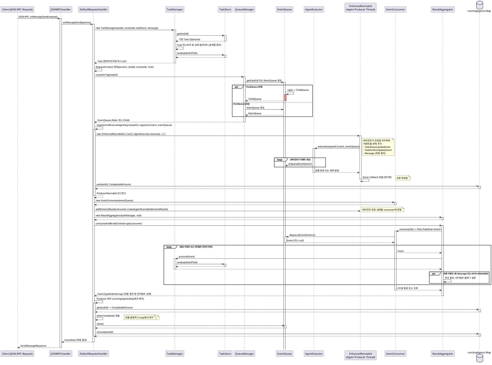

# A2A Java SDK 분석: `sdk-server-common` 모듈 상세

---

## 1. 개요 및 목적

`sdk-server-common` 모듈은 A2A(Agent2Agent) 프로토콜 기반의 서버 애플리케이션을 구축하는 데 필요한 **공통 컴포넌트와 핵심 비즈니스 로직**을 제공 이 모듈은 `a2a-java-sdk-core` 모듈에서 정의된 기본 데이터 모델(예: `AgentCard`, `Message`, `Task`)을 기반으로, 다음과 같은 핵심 기능을 담당:

* 클라이언트의 JSON-RPC 요청 처리

* 에이전트의 비동기 실행 관리

* 태스크의 생명주기 및 이벤트 스트리밍 관리

이 모듈은 특정 프레임워크(예: Jakarta EE, Quarkus)에 독립적으로 설계되어 다양한 서버 환경에서 재사용 가능

---

## 2. 주요 컴포넌트 및 패키지 구조

`sdk-server-common` 모듈은 기능별로 다음과 같은 주요 패키지들로 구성:

* **`requesthandlers`**: 클라이언트의 JSON-RPC 요청을 받아들이고 비즈니스 로직을 위임하는 최상위 진입점 역할 함

* **`agentexecution`**: 실제 에이전트의 비즈니스 로직을 실행하고 요청 컨텍스트를 관리하는 컴포넌트를 포함

* **`events`**: 에이전트와 서버 간의 비동기 이벤트 통신을 위한 큐(Queue)를 관리하고 이벤트를 소비

* **`tasks`**: 태스크의 생성, 저장, 업데이트, 푸시 알림 등 태스크의 생명주기를 관리하는 핵심 비즈니스 로직을 담당

* **`auth`**: 사용자 인증 및 인가와 관련된 기본적인 인터페이스를 정의

* **`util`**: 비동기 처리(`async` 패키지)와 같은 공통 유틸리티 기능들을 제공

**핵심 의존성**:

* `a2a-java-sdk-core`: A2A 프로토콜의 기반이 되는 데이터 모델 및 클라이언트 통신 기능을 제공

* `jackson-databind`, `jackson-datatype-jsr310`: JSON 데이터의 직렬화(Serialization) 및 역직렬화(Deserialization)를 처리 이는 JSON-RPC 기반의 통신에서 필수적인 역할 함

* `mutiny-zero`: 리액티브 프로그래밍을 위한 라이브러리로, 비동기 스트림(`Flow.Publisher`) 처리에 사용

* `jakarta.enterprise.cdi-api`, `jakarta.inject-api`: CDI(Contexts and Dependency Injection) 관련 API를 제공하여 의존성 주입을 통해 컴포넌트들을 관리

## 3. 핵심 데이터 흐름 분석: 메시지 전송 (`onMessageSend` & `onMessageSendStream`)

클라이언트가 에이전트에게 메시지를 보내는 요청은 A2A 프로토콜에서 가장 중요하고 빈번한 상호작용 중 하나 이 요청이 `sdk-server-common` 모듈에서 어떻게 처리되는지 두 가지 방식으로 분석

### 3.1. 단일 응답 흐름 (`onMessageSend`)

* **목적**: 클라이언트가 에이전트에게 메시지를 보내고, 에이전트의 작업이 완료되면 최종적으로 **하나의 결과** (태스크 객체 또는 메시지)를 응답받기를 기대할 때 사용

* **처리 흐름**:

    1. **JSON-RPC 요청 수신**: 클라이언트의 `SendMessageRequest`가 `JSONRPCHandler.onMessageSend()` 메서드로 유입

    2. **비즈니스 로직 위임**: `JSONRPCHandler`는 실제 비즈니스 로직 처리를 `@Inject`로 주입받은 `DefaultRequestHandler` 인스턴스에게 위임

    3. **태스크 관리**: `DefaultRequestHandler`는 `TaskManager`를 생성하고, 요청에 포함된 `taskId`를 기반으로 `TaskStore`에서 기존 태스크를 조회 태스크가 존재하면 수신된 메시지를 태스크의 `history`에 추가하고 `TaskStore`에 업데이트하여 태스크의 연속성 유지

    4. **요청 컨텍스트 구성**: `RequestContext` 객체를 생성하여 수신 메시지, 태스크 ID, 컨텍스트 ID 등 에이전트 실행에 필요한 모든 정보를 캡슐화 이 객체는 `AgentExecutor`로 전달

    5. **이벤트 큐 초기화**: `queueManager.createOrTap(taskId)`를 호출하여 해당 태스크의 `EventQueue`를 가져오거나 생성 이 큐는 에이전트가 이벤트를 발행하고 서버가 소비할 비동기 통신 채널 됨

    6. **에이전트 비동기 실행**: `registerAndExecuteAgentAsync()` 메서드를 통해 `AgentExecutor.execute()`를 **별도의 스레드에서 비동기적으로 실행** 에이전트는 실행 중 발생한 이벤트를 `EventQueue`에 발행 이 과정에서 `CompletableFuture`로 에이전트 실행을 관리하고 `runningAgents` 맵에 등록하여 취소 및 자원 해제 용이하게 함

    7. **이벤트 소비 및 결과 집계**:

        * `EventConsumer`는 `EventQueue`로부터 이벤트를 읽어오는 역할 함

        * `ResultAggregator.consumeAndBreakOnInterrupt()` 메서드가 `EventConsumer`를 통해 에이전트가 발행하는 이벤트를 소비하고, `TaskManager`를 통해 태스크 상태를 지속적으로 업데이트 함

        * 에이전트 작업 완료(`TaskState.COMPLETED`, `FAILED` 등) 또는 특정 조건(`TaskState.AUTH_REQUIRED`) 충족 시, 이벤트 소비를 중단하고 집계된 단일 `EventKind` (최종 `Task` 또는 `Message`)를 반환

    8. **응답 반환**: `DefaultRequestHandler`가 반환한 `EventKind`는 `JSONRPCHandler`에서 `SendMessageResponse` 객체에 담겨 클라이언트에게 전송

### 3.2. 스트리밍 응답 흐름 (`onMessageSendStream`)

* **목적**: 에이전트가 긴 시간 동안 작업을 수행하면서 발생하는 **모든 중간 진행 상황과 결과물(이벤트)을 실시간으로 연속해서** 클라이언트에게 전달할 때 사용 이는 장시간 실행되는 작업이나 단계별 진행 상황을 시각적으로 보여줘야 할 때 유용

* **`onMessageSend`와의 주요 차이점**:

    * 클라이언트에게 최종 단일 응답 대신 **지속적인 이벤트 스트림** (`Flow.Publisher`)을 제공

    * `ResultAggregator.consumeAndEmit()`를 사용하여 에이전트의 모든 이벤트를 스트림으로 내보내며, 특정 이벤트 발생 시 스트림을 중단하지 않음

* **처리 흐름**: (기존 `onMessageSend`의 1~6단계는 거의 동일하며, 7단계부터 차이 발생)

    1. **이벤트 스트림 생성 (`resultAggregator.consumeAndEmit(consumer)`)**:

        * `EventConsumer`는 `EventQueue`에서 발생한 이벤트를 읽어오는 역할 함

        * `ResultAggregator.consumeAndEmit()`는 `EventConsumer`로부터 받은 이벤트를 모두 소비하면서 태스크의 상태를 집계하고 내부 `TaskManager`를 통해 태스크를 업데이트 함 이 과정에서 이벤트는 `Flow.Publisher<Event>` 형태로 **다시 발행(Republish)**되어 스트림의 핵심 데이터 흐름을 형성

    2. **스트림 내 부가 로직 주입 (첫 번째 `processor`)**: 이 `Flow.Publisher<Event>`는 `AsyncUtils.processor`를 통과 각 이벤트가 이 `processor`를 지날 때마다 내부 람다식이 실행됨

        * **최초 태스크 ID 확정 및 큐 등록**: `if (event instanceof Task createdTask)` 조건문을 통해 에이전트가 발행한 최초의 `Task` 이벤트 내 `createdTask.getId()`를 사용하여 `queueManager.add(createdTask.getId(), queue);`를 호출하여 큐를 `queueManager`에 등록하고 `taskId` 참조 변수를 업데이트 이는 동적으로 태스크 ID가 할당되는 시나리오에 대비

        * **푸시 알림 전송**: `pushNotifier.sendNotification()`을 호출하여 태스크의 최신 상태를 외부 푸시 알림 서비스로 즉시 전송 이는 스트리밍 이벤트를 클라이언트에게 보내는 것과 별개로 외부 알림을 동시에 수행하는 부가 로직

        * 이 `processor`는 원본 이벤트를 계속해서 다음 단계로 **다시 발행(Republish)** 함

    3. **이벤트 타입 변환 (`convertingProcessor`)**: `AsyncUtils.convertingProcessor`를 사용하여 이전 `processor`에서 나온 `Flow.Publisher<Event>` 스트림을 A2A 프로토콜의 스트리밍 응답 타입인 `StreamingEventKind` (예: `Task`, `Message`, `TaskStatusUpdateEvent`, `TaskArtifactUpdateEvent` 등 `EventKind`의 하위 타입)으로 **타입 캐스팅(변환)**하여 새로운 `Flow.Publisher<StreamingEventKind>`를 반환

    4. **스트리밍 응답 반환**: `DefaultRequestHandler`가 반환한 `Flow.Publisher<StreamingEventKind>`는 `JSONRPCHandler`로 전달되어 `Flow.Publisher<SendStreamingMessageResponse>`로 맵핑된 후 클라이언트에게 실시간 스트림으로 제공 클라이언트는 이 스트림을 구독하여 에이전트의 모든 중간 이벤트를 지속적으로 수신
  
### 3.3. UML

```plantuml
@startuml
!pragma layout smetana

participant "Client (JSON-RPC Request)" as Client
participant "JSONRPCHandler" as JsonRpcHandler
participant "DefaultRequestHandler" as DefaultHandler
participant "TaskManager" as TaskManager
participant "TaskStore" as TaskStore
participant "QueueManager" as QueueManager
participant "EventQueue" as EventQueue
participant "AgentExecutor" as AgentExecutor
participant "EnhancedRunnable\n(Agent Producer Thread)" as ProducerRunnable
participant "EventConsumer" as EventConsumer
participant "ResultAggregator" as ResultAggregator
database "runningAgents Map" as RunningAgentsMap
participant "AsyncUtils.processor (1)" as Processor1
participant "AsyncUtils.convertingProcessor" as ConvertingProcessor

Client -> JsonRpcHandler: JSON-RPC onMessageSendStream(request)
activate JsonRpcHandler

JsonRpcHandler -> DefaultHandler: onMessageSendStream(params)
activate DefaultHandler

' === onMessageSend와 거의 동일한 초기 흐름 시작 ===
DefaultHandler -> TaskManager: new TaskManager(taskId, contextId, taskStore, message)
activate TaskManager
TaskManager -> TaskStore: get(taskId)
activate TaskStore
TaskStore --> TaskManager: 기존 Task (Optional)
deactivate TaskStore
TaskManager -> TaskManager: Task 히스토리 및 상태 업데이트 (존재할 경우)
TaskManager -> TaskStore: save(updatedTask)
activate TaskStore
TaskStore --> TaskManager:
deactivate TaskStore
TaskManager --> DefaultHandler: Task (업데이트되었거나 null)
deactivate TaskManager

DefaultHandler -> DefaultHandler: RequestContext 생성(params, taskId, contextId, Task)

DefaultHandler -> QueueManager: createOrTap(taskId)
activate QueueManager
QueueManager -> EventQueue: get(taskId) 또는 MainQueue 생성
activate EventQueue
alt TaskQueue 존재
    EventQueue -> EventQueue: tap() -> ChildQueue
    activate EventQueue #LightCoral
    EventQueue --> QueueManager: ChildQueue
    deactivate EventQueue #LightCoral
else TaskQueue 없음
    QueueManager -> EventQueue: MainQueue 생성
    EventQueue --> QueueManager: MainQueue
end
QueueManager --> DefaultHandler: EventQueue (Main 또는 Child)
deactivate QueueManager

DefaultHandler -> DefaultHandler: registerAndExecuteAgentAsync(taskId, requestContext, eventQueue)
activate DefaultHandler
    DefaultHandler -> ProducerRunnable: new EnhancedRunnable() { run() { AgentExecutor.execute(...) } }
    activate ProducerRunnable
    ProducerRunnable -> AgentExecutor: execute(requestContext, eventQueue)
    activate AgentExecutor
    note right
        에이전트가 요청을 처리하며
        이벤트를 큐에 추가:
        - TaskStatusUpdateEvent
        - TaskArtifactUpdateEvent
        - Message (최종 결과)
    end note
    loop 에이전트가 이벤트 생성
        AgentExecutor -> EventQueue: enqueueEvent(event)
    end
    AgentExecutor --> ProducerRunnable: 실행 완료 또는 예외 발생
    deactivate AgentExecutor
    ProducerRunnable -> ProducerRunnable: Done Callback 호출 (있다면)
    note right: 오류 전파용
    deactivate ProducerRunnable
    DefaultHandler -> RunningAgentsMap: put(taskId, CompletableFuture)
    activate RunningAgentsMap
    RunningAgentsMap --> DefaultHandler:
    deactivate RunningAgentsMap
DefaultHandler --> DefaultHandler: ProducerRunnable 인스턴스
deactivate DefaultHandler

DefaultHandler -> EventConsumer: new EventConsumer(eventQueue)
activate EventConsumer
EventConsumer --> DefaultHandler:
deactivate EventConsumer

DefaultHandler -> ProducerRunnable: addDoneCallback(consumer.createAgentRunnableDoneCallback())
note right: 에이전트 완료 상태를 consumer에 연결
' === onMessageSend와 거의 동일한 초기 흐름 끝 ===

DefaultHandler -> ResultAggregator: new ResultAggregator(taskManager, null)
activate ResultAggregator
ResultAggregator --> DefaultHandler:
deactivate ResultAggregator

DefaultHandler -> ResultAggregator: consumeAndEmit(consumer) -> Flow.Publisher<Event> (results)
activate ResultAggregator
    ResultAggregator -> EventConsumer: consumeAll() -> Flow.Publisher<Event>
    activate EventConsumer
    EventConsumer -> EventQueue: dequeueEvent(timeout)
    activate EventQueue
    EventQueue --> EventConsumer: Event (또는 null)
    deactivate EventQueue
    loop 에이전트가 큐에 이벤트를 넣는 동안
        EventConsumer --> ResultAggregator: Event
        ResultAggregator -> TaskManager: process(Event)
        activate TaskManager
        TaskManager -> TaskStore: save(updatedTask)
        activate TaskStore
        TaskStore --> TaskManager:
        deactivate TaskStore
        TaskManager --> ResultAggregator:
        deactivate TaskManager
        ResultAggregator -> ResultAggregator: Event를 다음 스트림으로 emit
    end
    EventConsumer --> ResultAggregator: 스트림 종료 (에이전트 완료 시)
    deactivate EventConsumer
ResultAggregator --> DefaultHandler: Flow.Publisher<Event> (results)
deactivate ResultAggregator

DefaultHandler -> Processor1: processor(config, results, lambda_func) -> Flow.Publisher<Event> (eventPublisher)
activate Processor1
    loop 각 Event 발행
        Processor1 -> DefaultHandler: Event (람다식 실행)
        note right: **[부가 로직 주입]**
        note right: - 최초 Task 이벤트 시 taskId 확정/큐 등록
        note right: - PushNotifier로 Task 상태 알림
        alt Event instanceof Task (최초 Task 이벤트)
            DefaultHandler -> QueueManager: add(createdTask.getId(), eventQueue)
            activate QueueManager
            QueueManager --> DefaultHandler: (TaskQueueExistsException 예상)
            deactivate QueueManager
            DefaultHandler -> DefaultHandler: taskId 참조 업데이트
        end
        DefaultHandler -> PushNotifier: sendNotification(latestTask)
        activate PushNotifier
        PushNotifier --> DefaultHandler:
        deactivate PushNotifier
        DefaultHandler --> Processor1:
        Processor1 -> Processor1: Event를 다음 스트림으로 emit
    end
    Processor1 --> DefaultHandler: Flow.Publisher<Event> (eventPublisher)
deactivate Processor1

DefaultHandler -> ConvertingProcessor: convertingProcessor(eventPublisher, converter_func) -> Flow.Publisher<StreamingEventKind>
activate ConvertingProcessor
    loop 각 Event 발행
        ConvertingProcessor -> ConvertingProcessor: Event를 StreamingEventKind로 변환
        ConvertingProcessor -> ConvertingProcessor: StreamingEventKind를 다음 스트림으로 emit
    end
    ConvertingProcessor --> DefaultHandler: Flow.Publisher<StreamingEventKind>
deactivate ConvertingProcessor

DefaultHandler -> DefaultHandler: Producer 정리 (runningAgentsMap에서 제거)
activate DefaultHandler
    DefaultHandler -> RunningAgentsMap: get(taskId) -> CompletableFuture
    activate RunningAgentsMap
    RunningAgentsMap --> DefaultHandler:
    deactivate RunningAgentsMap
    DefaultHandler -> DefaultHandler: whenComplete() 호출
    note right: 에이전트 실행 완료 또는 오류 시, 큐를 종료하고 map에서 제거
    DefaultHandler -> EventQueue: close()
    activate EventQueue
    EventQueue --> DefaultHandler:
    deactivate EventQueue
    DefaultHandler -> RunningAgentsMap: remove(taskId)
    activate RunningAgentsMap
    RunningAgentsMap --> DefaultHandler:
    deactivate RunningAgentsMap
deactivate DefaultHandler

DefaultHandler --> JsonRpcHandler: Flow.Publisher<StreamingEventKind>
deactivate DefaultHandler

JsonRpcHandler -> JsonRpcHandler: convertToSendStreamingMessageResponse(requestId, publisher)
activate JsonRpcHandler
note right
    Publisher를 구독하고,
    각 StreamingEventKind를
    SendStreamingMessageResponse에 담아 발행
    오류 발생 시, SendStreamingMessageResponse 내부에
    JSONRPCError를 담아 발행 (스트림 오류가 아닌 페이로드 오류)
end note
loop 각 StreamingEventKind 발행
    JsonRpcHandler --> Client: SendStreamingMessageResponse (Event)
end
JsonRpcHandler --> Client: SendStreamingMessageResponse (스트림 종료 또는 오류)
deactivate JsonRpcHandler

@enduml
```

## 4. 기타 주요 요청 처리 흐름 (간략 요약)

* **태스크 조회 (`onGetTask`)**: `TaskQueryParams`로 `taskId`를 받아 `TaskStore`에서 태스크를 조회하여 반환 `historyLength` 파라미터에 따라 반환할 태스크 히스토리의 길이를 조절 가능

* **태스크 취소 (`onCancelTask`)**: `TaskIdParams`로 `taskId`를 받아 `TaskStore`에서 태스크를 조회한 후, `AgentExecutor.cancel()`을 호출하여 에이전트의 취소 로직을 실행 `runningAgents` 맵에 등록된 `CompletableFuture`를 `cancel(true)`하여 비동기 실행도 중단 이후 `EventConsumer`와 `ResultAggregator`를 통해 취소 결과(태스크 상태)를 받아 반환

* **태스크 푸시 알림 설정/조회 (`onSetTaskPushNotificationConfig`, `onGetTaskPushNotificationConfig`)**: `PushNotifier`를 통해 특정 태스크에 대한 푸시 알림 설정을 저장하거나 조회
